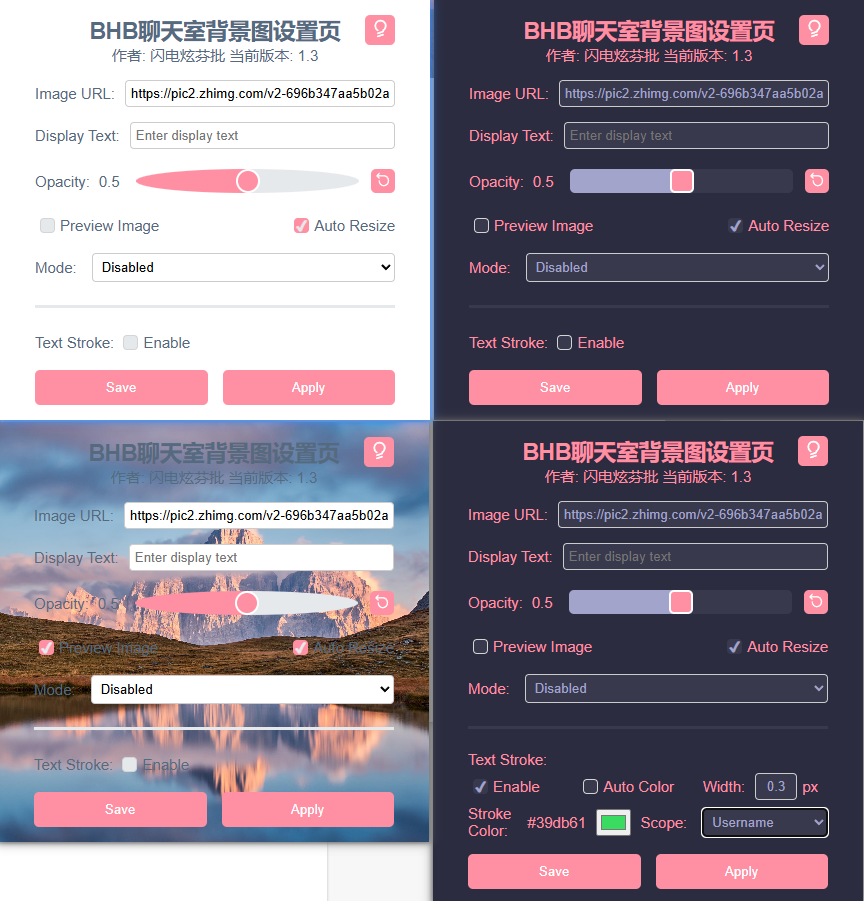
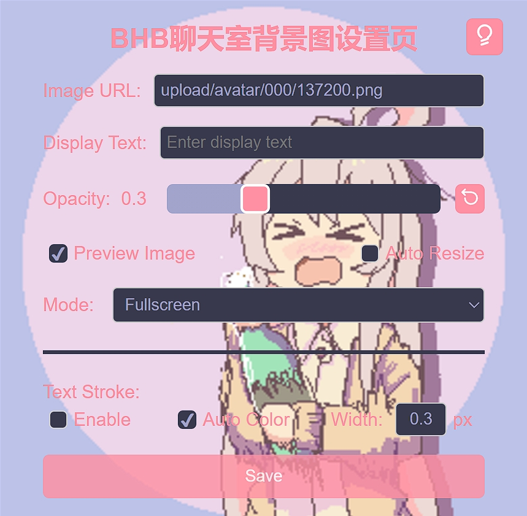
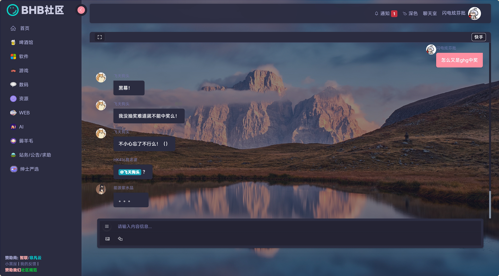

# BHBChatRoomBG

## 简介

这是一个给BHB聊天室添加图片（外链）的插件，支持5种显示模式，支持暗色模式，且其中两种模式去除了输入框上方“白条/黑条”。

> 这个插件按照W3标准编写，对Chrome的兼容由[polyfill](https://github.com/mozilla/webextension-polyfill)提供。

## 特点

1. 能够显示**外链**的用户头像，完美适配。（需要发送者的发送参数以`http://`或`https://`起始）

## 安装

### 稳定版

#### Chrome/Edge

解压压缩包，在扩展管理页面开启“开发人员模式”，点击“加载解压缩的扩展”，选择解压后的目录。（同开发版安装方式）

> 已取消上架计划。因为作者似乎没有什么开发者账户的用途，而注册又要钱，但是作者又不想绑付款方式（会让换区变麻烦），再加上本来就可以本地解压并加载，而且又没人提手机安装，所以嘛，摆了。

#### Firefox

*上架版*：

到火狐扩展商店，搜索BHB，安装名为`BHB聊天室背景插入插件`的那个就行。安卓也可用。

传送门：[门](https://addons.mozilla.org/zh-CN/firefox/addon/bhb聊天室背景插入插件/)

*不上架版*：

进入扩展管理页面，点击右上角“设置”（齿轮图标），点击“从文件安装附加组件...”，选择对应的`.xpi`文件即可。

> **安卓**：需要先到“设置”中的“关于Firefox”页面，点5下火狐图标打开“调试菜单”，回到“设置”页面，在“高级”部分，点击新出现的“从文件安装扩展”，选择对应的`.xpi`文件即可。
>
> > “调试菜单”时仅本次（浏览器）运行有显示，关闭APP后台重启就消失了，但是通过这个方法安装的扩展还会保留。

### 开发版

#### Chrome/Edge

当前版本，在项目根目录执行`pack.bat`后`build/BHBChatRoomBG/`下的可以直接供Chrome加载。以下以Edge举例：打开扩展页，在左侧边栏启用“开发人员模式”，在“已安装的扩展”右侧点击“加载解压缩的扩展”，选择`build`目录下的`BHBChatRoomBG`文件夹即可。

> 注：若火狐正直接加载着`build`目录下的`BHBChatRoomBG.xpi`，则`pack.bat`无法完整执行，提示拒绝访问，但这不影响Chrome/Edge版的打包，无视即可。

#### Firefox

在地址栏输入`about:debugging`进入调试页面，点击`This Firefox`下的`Load Temporary Add-on...`按钮，选择`build/BHBChatRoomBG.xpi`文件，即可安装插件。（适用于无扩展ID时）

## 使用方法

点击插件，在弹出的页面设置链接和文本，点击Save保存，刷新页面即可。模式切换到`Disabled`即可不再生效。

> - 关于链接：如果链接不是http(s)://协议开头，默认会当作BHB站内链接，这可能导致链接识别错误。所以，站外链接请使用完整链接。清空链接并保存，刷新聊天室就不会再插入背景了。
> - 关于文本：这玩意是可选的，不填也行。文本和链接是一体的，如果不插链接则文本也不会显示。文本在仅聊天框背景模式不生效。

## 效果图

手机效果图见：[手机效果图](手机效果图.md)

## LICENSE Summary

项目本体基于MIT，但使用了一些第三方库，它们的LICENSE文件也可能适用。

- [polyfill](https://github.com/mozilla/webextension-polyfill/blob/master/LICENSE) MPL-2.0
