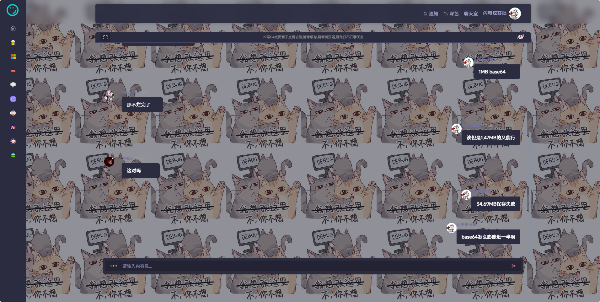

# BHBChatRoomBG

## 简介

这是一个给BHB聊天室添加图片（外链）的插件。

这个插件按照W3标准编写，对Chrome的兼容由[polyfill](https://github.com/mozilla/webextension-polyfill)提供。

## 安装

### 稳定版

### 开发版

#### Chrome/Edge

见[【开发说明】](#开发说明)。

#### Firefox

在地址栏输入`about:debugging`进入调试页面，点击`This Firefox`下的`Load Temporary Add-on...`按钮，选择`build/BHBChatRoomBG.xpi`文件，即可安装插件。（适用于无扩展ID时）

## 使用方法

点击插件，在弹出的页面设置链接和文本，点击Save保存即可。

## 效果图

## 开发说明

当前版本，在项目根目录执行`pack.bat`后`build/BHBChatRoomBG/`下的可以直接供Chrome加载。

## LICENSE Summary

项目本体基于MIT，但使用了一些第三方库，它们的LICENSE文件也可能适用。

- [polyfill](https://github.com/mozilla/webextension-polyfill/blob/master/LICENSE) MPL-2.0
